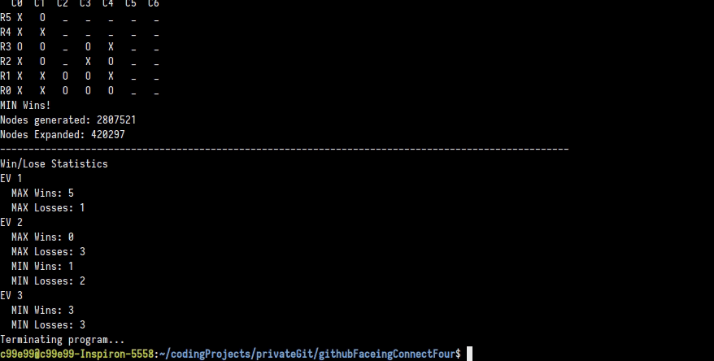

# ConnectFourGame
This school project was done with the following teammates:
James Helgren, and Verginia Dole

The following is a connect four game that implements the min-max-AB algorithm. It 
carries out 8 test cases in the following gif:

